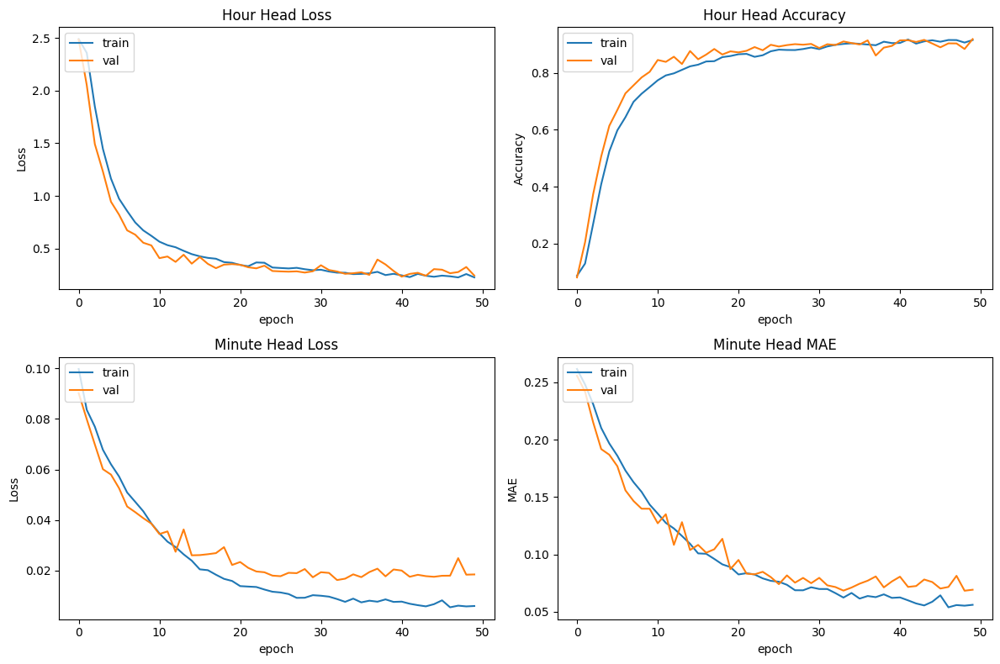
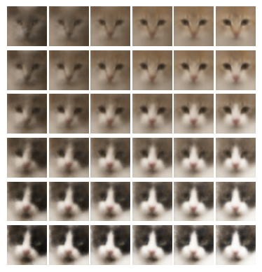

# Deep Learning Methods

This repository contains coursework code for the Deep Learning subject. The notebooks located in the MNIST directory are 
intended to provide introductory knowledge of deep learning methods. Additionally, the code in the TensorFlow directory 
includes records of learning its basic API and developing multiple networks.

## Overview

The MNIST directory contains techniques used for solving the common MNIST problem. It starts with some distance-based 
methods, progresses through dimensionality reduction algorithms, clustering methods, MLP, and implementing a custom 
variation of SGD. In the second notebook, a Neural Network was implemented entirely from scratch.

The TensorFlow directory contains code used to learn the basics of its API. Additionally, the tell-the-time problem was 
solved and compared using various MLP, CNN, and even multi-headed architectures. Finally, the generative models were 
evaluated through experiments conducted on learned latent spaces.

## Figures

All figures can be found in notebooks and `figures` directory.

### Multi-head Model Metrics

### Latent Space Cat Example

